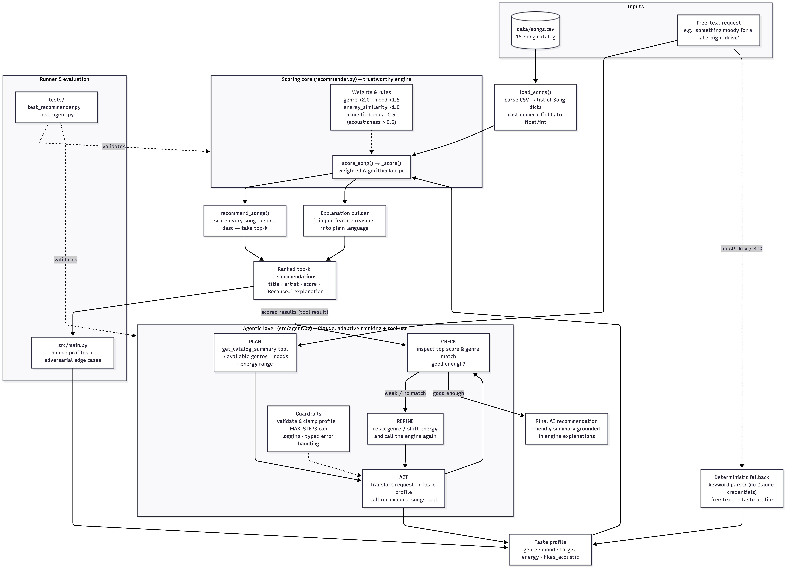

# 🎵 VibeFinder 2.0: Agentic Music Recommender

**What it does:** You describe the music you want in plain English (like *"something
moody for a late-night drive"*), and the system uses an AI agent (Claude) to turn that
into a structured taste profile, score every song in the catalog with a transparent
rule-based engine, check whether the results are actually good, and refine if they
aren't. It returns a ranked list of songs, each with a plain-language *"Because…"*
explanation.

**Why it matters:** Most recommenders are black boxes, so you can't see *why* a song was
picked. VibeFinder pairs a fully transparent scoring engine (every point is auditable)
with an AI planning layer that handles messy natural language. The AI decides *what to
ask for*; the deterministic engine decides *the actual scores*. That split keeps the
recommendations explainable and trustworthy while still accepting free-form requests.
It's a small, readable model of how real content-based recommenders balance flexibility
against accountability.

---

## Original Project (Modules 1-3)

This project extends **VibeFinder 1.0**, my Module 1-3 submission. VibeFinder 1.0 was a
content-based music recommender over a hand-built 18-song catalog: a listener supplied a
structured taste profile (`favorite_genre`, `favorite_mood`, `target_energy`,
`likes_acoustic`), and the system scored every song with a weighted point recipe (genre
match, mood match, energy closeness, acoustic bonus), then returned the top matches with
a per-feature explanation of each score. Its goal was to show that a "recommendation" is
really just **transparent scoring plus ranking**, and to make the resulting biases (like
genre dominance) visible and measurable rather than hidden.

**Module 4 (VibeFinder 2.0)** keeps that engine unchanged and wraps it in an **agentic AI
layer** so the system now accepts natural-language requests and self-corrects. See
[The Advanced AI Feature](#the-advanced-ai-feature-agentic-workflow) below.

---

## Architecture Overview



*Diagram source: [`diagrams/architecture.mmd`](diagrams/architecture.mmd), a Mermaid
source file, editable and renderable at [mermaid.live](https://mermaid.live).*

The system has three main components and a clear input → process → output flow:

1. **Input.** A human **listener** submits a free-text request; the **song catalog**
   (`data/songs.csv`) is loaded and parsed by `load_songs()`.
2. **Agentic layer** (`src/agent.py`, the "agent") is the new AI component. It runs a
   **Plan → Act → Check → Refine** loop: it *plans* a taste profile from the request,
   *acts* by calling the scoring engine as a tool, *checks* the returned scores, and
   *refines* the profile if the catalog fit is weak.
3. **Scoring core** (`src/recommender.py`, the trustworthy "engine") is the deterministic
   component carried over from 1.0. It scores every song against the taste profile,
   ranks them, and builds the *"Because…"* explanations. **This is the only thing that
   produces scores**: the AI never invents songs or numbers.
4. **Output.** A ranked top-k list with explanations, summarized into a friendly final
   recommendation.

**Where results get checked** (three verification points, all shown on the diagram):

- **AI self-check:** the agent's *CHECK* step inspects the top score and genre match and
  loops back to *REFINE* if the fit is poor.
- **Automated testing:** the `tests/` suite (`test_recommender.py`, `test_agent.py`)
  *checks the results of* both the scoring engine and the agent's deterministic pieces.
- **Human-in-the-loop:** the listener *reviews and accepts/rejects* the final AI
  recommendation, closing the loop.

---

## The Advanced AI Feature: Agentic Workflow

VibeFinder 2.0 adds an **agentic layer** ([`src/agent.py`](src/agent.py)) powered by
Claude. Instead of hand-filling a structured profile, the listener types a request in
plain language and the agent **plans, acts, and checks its own work**:

| Stage | What the agent does |
|-------|---------------------|
| **Plan** | Calls the `get_catalog_summary` tool to learn which genres/moods actually exist, then translates the free-text request into a taste profile. |
| **Act** | Calls the `recommend_songs` tool (*the existing deterministic scoring engine*) to generate real, scored recommendations. |
| **Check** | Reads the returned scores. A weak top score or a missing genre match means the catalog fit is poor. |
| **Refine** | Adjusts the profile (e.g. relaxes an unavailable genre to the closest one, or shifts target energy) and calls the engine again. |

The AI is **fully integrated into the main application logic**, not bolted on: the
rule-based scorer is exposed to Claude as a *tool*, so the model decides *what to ask
for* and *whether the answer is good enough*, while the trustworthy engine does the
actual scoring. Claude never invents songs, artists, or scores.

### Reliability & guardrails

- **Logging:** every Plan / Act / Check step is logged to stderr and `logs/agent_run.log`.
- **Input validation:** profiles produced by the model are clamped and coerced
  (`target_energy` forced into `[0, 1]`, `k` bounded, genres/moods lowercased) before scoring.
- **Iteration cap:** the agent loop is bounded (`MAX_STEPS`) so it can never spin forever.
- **Graceful fallback:** if the Anthropic SDK isn't installed or no credentials are
  found, the system falls back to a deterministic keyword parser and still runs, so the
  project is **reproducible without any secret**.
- **Typed error handling:** auth, connection, and API-status errors are caught and
  routed to the fallback rather than crashing.

---

## Setup Instructions

1. **Clone and enter the project:**

   ```bash
   git clone https://github.com/pkr85941/applied-ai-system-project.git
   cd applied-ai-system-project
   ```

2. **Create a virtual environment** (optional but recommended):

   ```bash
   python -m venv .venv
   source .venv/bin/activate      # Mac or Linux
   .venv\Scripts\activate         # Windows
   ```

3. **Install dependencies:**

   ```bash
   pip install -r requirements.txt
   ```

4. **Run the deterministic recommender** (named profiles plus adversarial edge cases):

   ```bash
   python -m src.main
   ```

5. **(Optional) Enable the AI agent.** Set your Anthropic API key so the agentic layer
   can call Claude:

   ```bash
   export ANTHROPIC_API_KEY=sk-ant-...      # Mac or Linux
   setx ANTHROPIC_API_KEY sk-ant-...        # Windows
   ```

   Then ask for a recommendation in plain language:

   ```bash
   python -m src.agent "something moody for a late-night drive"
   ```

   > **No API key?** The command still works. It automatically falls back to a
   > deterministic keyword parser and tells you it did so, so the project is fully
   > runnable without secrets. To use a different or cheaper model, set
   > `VIBEFINDER_MODEL` (defaults to `claude-opus-5`), e.g.
   > `export VIBEFINDER_MODEL=claude-haiku-4-5`.

6. **Run the tests:**

   ```bash
   pytest
   ```

---

## Sample Interactions

### A) The agentic path (with an API key set), representative

With `ANTHROPIC_API_KEY` set, the agent plans a profile, calls the engine, checks the
result, and refines. Example of the *plan → act → check → refine* behavior on an
out-of-catalog request:

```
$ python -m src.agent "I want some opera, something dramatic"

[PLAN]  get_catalog_summary() → catalog has no 'opera'; closest dramatic genres: classical, metal
[ACT]   recommend_songs(genre='classical', mood='romantic', energy=0.4, likes_acoustic=false)
[CHECK] top score 4.35, strong classical match found, good enough

There's no opera in the catalog, so I went with the closest dramatic fit, classical:

1. Slow Waltz for You by Elena Voss  (score 4.35)
   Because: genre match (+2.0), mood match (+1.5), energy similarity (+0.85)
```

*(Transcript is representative of the agent's behavior; the bracketed `[PLAN]/[ACT]/[CHECK]`
lines mirror what is written to `logs/agent_run.log`.)*

### B) The deterministic fallback path (no API key), verified and reproducible

These are **real captured runs** from `python -m src.agent "..."` with no credentials
configured, so the system parses the request with keywords and calls the same engine:

**Input:** `"something upbeat and happy for a pop workout"`
```
Parsed profile: {'genre': 'pop', 'mood': 'happy', 'energy': 0.9, 'likes_acoustic': False}

1. Sunrise City by Neon Echo - score 4.42
   Because: genre match (+2.0), mood match (+1.5), energy similarity (+0.92)
2. Gym Hero by Max Pulse - score 2.97
   Because: genre match (+2.0), energy similarity (+0.97)
3. Rooftop Lights by Indigo Parade - score 2.36
   Because: mood match (+1.5), energy similarity (+0.86)
```

**Input:** `"give me intense rock for the gym"`
```
Parsed profile: {'genre': 'rock', 'mood': 'intense', 'energy': 0.9, 'likes_acoustic': False}

1. Storm Runner by Voltline - score 4.49
   Because: genre match (+2.0), mood match (+1.5), energy similarity (+0.99)
2. Gym Hero by Max Pulse - score 2.47
   Because: mood match (+1.5), energy similarity (+0.97)
```

**Input:** `"calm ambient music to fall asleep to"`
```
Parsed profile: {'genre': 'ambient', 'mood': '', 'energy': 0.3, 'likes_acoustic': False}

1. Spacewalk Thoughts by Orbit Bloom - score 2.98
   Because: genre match (+2.0), energy similarity (+0.98)
2. Quiet Harbor by Paper Lanterns - score 2.88
   Because: genre match (+2.0), energy similarity (+0.88)
```

---

## Design Decisions

**Why an agentic workflow (and not RAG or a fine-tuned model).** The catalog is tiny (18
songs), so retrieval-augmented generation would be contrived, and fine-tuning is
infeasible without training data. An agent, by contrast, reuses the *entire* existing
engine as a tool (no vector DB, no second model) and genuinely changes behavior:
free-text in, self-correcting output. *Trade-off:* the agentic path needs an API key and
network access, which I mitigate with the deterministic fallback so the repo always runs.

**Keep the deterministic engine as the trustworthy core.** The AI is only allowed to
*call* the scoring engine, never to produce scores itself. This keeps every
recommendation auditable and prevents the model from hallucinating songs. *Trade-off:*
the agent is only ever as good as the engine and the 18-song catalog. It can reason
about the request, but it can't conjure a better-matching song that doesn't exist.

**A hand-written agent loop instead of the SDK's tool-runner helper.** I wrote the
`while stop_reason == "tool_use"` loop explicitly so every Plan/Act/Check step is easy to
log and reason about, and so the code has no beta-API dependency. *Trade-off:* a few more
lines of code than the built-in runner.

**Default to a strong model, but make it configurable.** The default is `claude-opus-5`
with adaptive thinking for the best planning quality, overridable via `VIBEFINDER_MODEL`
(e.g. `claude-haiku-4-5`) for cost/latency. *Trade-off:* quality-by-default costs more
per call; the env var is the escape hatch.

**Fail safe, not closed.** Missing credentials, auth errors, connection errors, and API
errors all route to the deterministic fallback rather than crashing. *Trade-off:* the
fallback is a blunt keyword matcher. It can't understand nuance like *"moody late-night
drive"* the way the LLM can, so a graceful degrade is a real drop in quality, just not in
availability.

---

## Testing Summary

**At a glance:** 10 of 10 automated tests pass; the AI/agent path was human-evaluated on
6 free-text requests (5 pass, 1 initially failed on an edge case and passes after a fix).
Reliability is enforced three ways: automated tests, logging, and error handling that
degrades to a deterministic fallback.

**Automated tests (`pytest`)**

| Area under test | Tests | Result |
|---|---|---|
| Scoring engine: ranking order & explanations (`test_recommender.py`) | 2 | ✅ pass |
| Agent: input validation & clamping (`test_agent.py`) | 2 | ✅ pass |
| Agent: catalog summary | 1 | ✅ pass |
| Agent: keyword fallback (genre/mood/energy/acoustic parsing) | 2 | ✅ pass |
| Agent: tool dispatch (grounded results, unknown-tool error) | 3 | ✅ pass |
| **Total** | **10** | **✅ 10/10** |

**Human evaluation of system outputs** (real captured runs; criteria checked by me)

| Test input | Evaluation criteria | Result |
|---|---|---|
| `"upbeat and happy for a pop workout"` | Top pick is an upbeat pop song | ✅ Pass, *Sunrise City* (pop/happy, 4.42) |
| `"intense rock for the gym"` | Top pick is an intense rock song | ✅ Pass, *Storm Runner* (rock/intense, 4.49) |
| `"calm ambient music to fall asleep to"` | Returns calm/ambient, no aggressive tracks | ⚠️ Fail → ✅ Pass after fix (see below) |
| `"some opera please"` (genre absent from catalog) | Degrades gracefully, no crash | ✅ Pass, falls back to energy scoring |
| *(empty input)* | Handled safely, no crash | ✅ Pass, prompts for a request |
| out-of-range `target_energy` (e.g. `5.0`) | Clamped into `[0, 1]` before scoring | ✅ Pass, validated by guardrail plus unit test |

Full details below.

**What I tested.** 10 automated tests (`pytest`): the scoring engine
(`tests/test_recommender.py`) and the agent's deterministic pieces
(`tests/test_agent.py`: input validation/clamping, catalog summary, the keyword
fallback, and tool dispatch). I also ran the end-to-end command on several varied
free-text requests.

**What worked.**
- All 10 tests pass, and the scoring engine is fully deterministic, so results are
  reproducible run-to-run.
- The guardrails behave: out-of-range `target_energy` is clamped to `[0, 1]`, garbage
  values fall back to safe defaults, and the tool dispatcher only ever returns real
  catalog songs.
- The no-credentials fallback runs cleanly end-to-end and clearly announces that it is
  the fallback path.

**What didn't (and how I fixed it).** Testing the request *"calm ambient music to fall
asleep to"* exposed a real bug in the keyword fallback: when no mood word matched, it
defaulted to the **alphabetically-first** mood (which happens to be *"aggressive"*), so a
sleep playlist was being scored for aggression and surfaced a metal track (*Broken
Mirror*). I fixed the parser to leave genre/mood **blank** when nothing is detected,
rather than guessing a misleading default; the same request now correctly returns calm
ambient tracks. This is committed and covered by the fallback tests.

**What I couldn't unit-test.** The live Claude loop itself isn't unit-tested, because it
requires API credentials and is non-deterministic. I deliberately structured the code so
the *deterministic* pieces (validation, parsing, tool dispatch) are pure functions that
**can** be tested in isolation, and isolated the non-deterministic LLM call behind them.

**What I learned.** Edge-case inputs surface silent defaults that "happy path" testing
never touches. The aggressive-mood default had been invisible until I tried a request it
didn't handle. And keeping the AI layer thin over a deterministic, testable core made the
whole system far easier to trust and verify than if the model were producing scores directly.

---

## Under the Hood: The Scoring Engine

The AI layer is new, but the scoring logic below is the transparent core it calls into.

### Finalized Algorithm Recipe

| Rule | Points |
|---|---|
| Genre match | `+2.0` |
| Mood match | `+1.5` |
| Energy similarity | `+1.0 × (1 - \|song.energy - target_energy\|)` |
| Acoustic bonus | `+0.5` if `likes_acoustic` is `True` and `song.acousticness > 0.6` |

For **categorical** features (genre, mood) the engine awards points for an exact match.
For **numeric** features (energy) it rewards *closeness* to the target rather than
"bigger is better." Genre outweighs mood because it's the strongest "right bucket / wrong
bucket" signal; energy is a continuous reward since it's a closeness measure; the acoustic
bonus is small and conditional since it only matters to some listeners. The **Ranking
Rule** then sorts every scored song descending and returns the top *k*.

### Expected biases

- **Genre dominance:** because genre is worth the most, a "right genre, wrong mood" song
  can outrank a "wrong genre, perfect mood/energy" song. The system may over-prioritize
  genre and miss great cross-genre matches.
- **Small, hand-picked catalog:** 18 songs across ~13 genres means most genres have only
  1-2 songs, so results are constrained by what exists in the CSV rather than a true
  "best match."
- **No history / collaborative signal:** it can only compare stated preferences to song
  metadata, so it can't surprise a listener with something outside their stated taste.

---

## Limitations and Risks

- Works on a tiny, hand-picked catalog of 18 songs (most genres have 1-3 tracks), so
  results are bounded by what exists in the CSV rather than real-world music.
- Understands no lyrics, artist popularity, or listening history, only the
  numeric/categorical tags in the CSV.
- Genre is the heaviest-weighted signal, so it can over-favor a matching genre even when a
  mismatched-genre song would feel closer to the listener's mood/energy.
- It cannot detect contradictory preferences (e.g. `genre=metal, mood=sad`), so it
  maximizes whatever score is available and confidently returns a top 5 regardless.
- The agentic path depends on an external API (cost, latency, and availability); the
  keyword fallback keeps the system *available* but at noticeably lower quality.

See [model_card.md](model_card.md) for the full evaluation, including adversarial profiles
that surfaced these issues directly.

---

## Reflection

Building this reinforced that a "recommendation" is really just scoring plus sorting, and
that layering an AI agent on top doesn't change where the intelligence (or the bias)
lives: it lives in the engine's weights. The agent made the system *easier to talk to*,
not *more objective*.

> **Note:** My graded responsible-AI reflection (how I collaborated with AI, one helpful
> and one flawed AI suggestion, and the system's limitations) lives in
> [**model_card.md**](model_card.md), not here.
